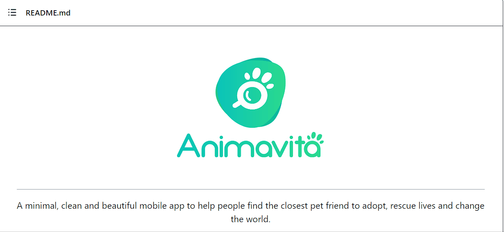

# Projeto com README
Um projeto de teste para aprendar a usar o README.md 🚀

[](https://github.com/animavita/animavita)

## Tecnologias utilizadas
- HTML
- CSS
- JS
- Screen to Gif

## Como utilizar

1 - Clone o projeto
```
git clone <url>
```

2 - Acesse a pasta do projeto
```
cd repositorio-com-readme
```